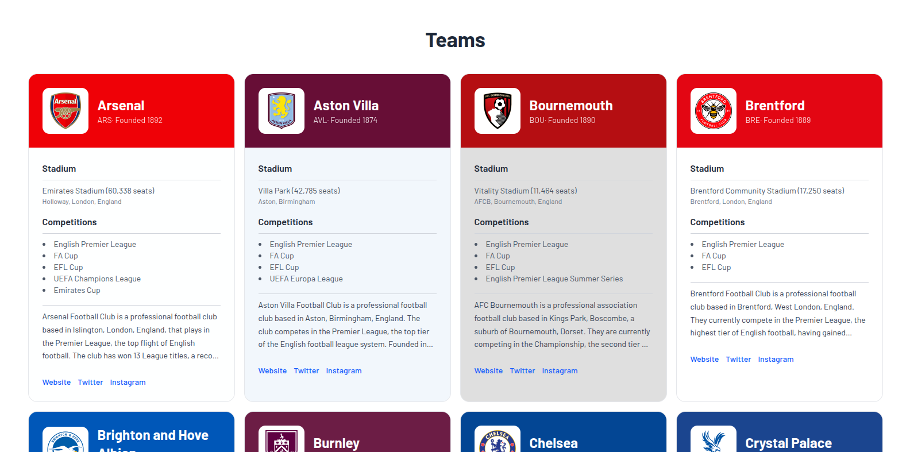
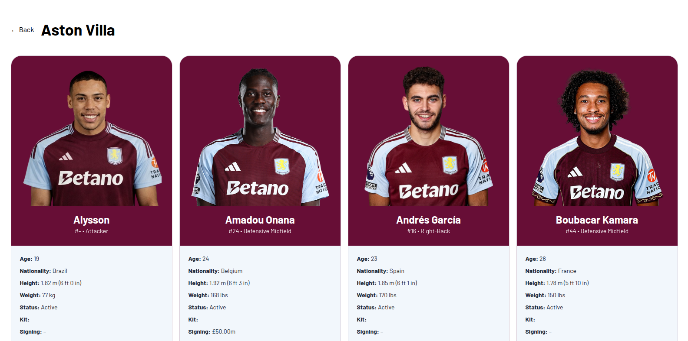

# Sports App

This is an update to [this project](https://github.com/sankthomas/sports-app) as the API was updated.

> This project uses React Vite, the original project used React Native Expo

## Demo

Above shows the landing page when you run the application. Below is the dynamic page you are linked to when you click on one of the teams:

Of course, the players page changes to show the correct data for all teams.

## How to run

1. Clone or download the repository
2. Install `node_modules`
3. Run the app using `npm dev`
4. Open `http://localhost:5173` to see the app.
